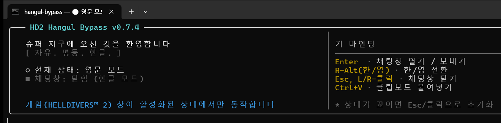

# HD2 Hangul Bypass

**HELLDIVERS™ 2 전용 — IME 없이 게임 채팅에 한글을 직접 주입하는 Windows 도구**

HELLDIVERS™ 2의 채팅창에서 Windows IME가 동작하지 않아 한글 입력이 불가능한 문제를 우회합니다.
영문 키보드 입력을 가로채 실시간으로 한글로 변환하여 주입합니다.



---

## 동작 원리

| 단계 | 설명 |
|------|------|
| **키 가로채기** | `keyboard.hook(suppress=True)` — 저수준 키보드 훅으로 원본 키 이벤트 차단 |
| **한글 조합** | 두벌식 자모 매핑 + `py-hangul-utils`로 실시간 조합 (초성·중성·종성 분리/결합) |
| **문자 주입** | `keyboard.write(delay=0.01)` — `SendInput` + `KEYEVENTF_UNICODE`로 게임에 직접 전달 |
| **차이 주입** | 이전 텍스트와 비교하여 변경된 부분만 백스페이스 + 재입력 (최소 키 이벤트) |

> 게임의 안티치트가 `OpenProcess`를 차단하기 때문에, 활성 창 감지는 `GetWindowTextW` 기반으로 동작합니다.

---

## 주요 기능

- **실시간 한글 조합** — 두벌식 키보드 레이아웃 기반, 쌍자음/복합모음 지원
- **채팅창 상태 추적** — Enter/Esc로 채팅 열림/닫힘 감지, 모드 자동 전환
- **모드 기억** — 채팅창을 닫았다 열어도 이전 한/영 모드 유지
- **활성 창 감지** — 게임 윈도우가 포커스일 때만 동작 (다른 앱에 영향 없음)
- **터미널 UI** — HD2 테마 배너, 현재 모드/채팅 상태 실시간 표시
- **단독 실행 파일** — PyInstaller로 빌드된 `.exe` 배포 가능

---

## 설치 및 실행

### EXE (권장)

[Releases](../../releases)에서 `hangul-bypass.exe`를 다운로드하여 실행합니다.
게임 실행 전/후 상관없이 창을 띄워두면 됩니다.

- 동작하지 않으면 **관리자 권한**으로 실행
- 상태가 꼬이면 `Esc`를 눌러 초기화

> exe 파일 특성상 다운로드 시 브라우저 경고, 실행 시 Windows SmartScreen 경고가 뜰 수 있습니다.
> "추가 정보" → "실행"을 누르면 됩니다.

### Python 소스

```bash
pip install -r requirements.txt
python hangul_bypass.py
```

### 디버그 모드

```bash
python hangul_bypass.py --debug
```

---

## 키 바인딩

| 키 | 동작 |
|----|------|
| `R-Alt` / `한/영` | 한글 ↔ 영문 전환 |
| `Enter` | 채팅창 열기 (모드 복원) / 메시지 전송 (영문 전환) |
| `Esc` | 채팅창 닫기 + 영문 전환 |
| `Backspace` | 조합 중이면 마지막 자모 삭제, 아니면 원래 동작 |
| `Space` | 현재 조합 확정 + 공백 입력 |
| `Ctrl+C` | 프로그램 종료 |

- **CapsLock**이 켜져 있어도 쌍자음으로 입력되지 않습니다 (Shift만 쌍자음 인식).
- **Ctrl/Alt 조합**(Ctrl+C, Alt+Tab 등)은 한글 모드에서도 그대로 통과합니다.

---

## 빌드

```bash
pip install pyinstaller
pyinstaller hangul-bypass.spec
# → dist/hangul-bypass.exe
```

---

## 기술 스택

| 구성 요소 | 라이브러리 / API |
|-----------|-----------------|
| 키보드 훅 & 주입 | [keyboard](https://github.com/boppreh/keyboard) (`SendInput`, `KEYEVENTF_UNICODE`) |
| 한글 조합 | [py-hangul-utils](https://pypi.org/project/py-hangul-utils/) |
| 활성 창 감지 | Win32 `GetForegroundWindow` + `GetWindowTextW` |
| 배포 | PyInstaller (단일 EXE) |

---

## 제한 사항

- **Windows 전용** — Win32 API와 `keyboard` 라이브러리 의존
- **관리자 권한 필요** — 저수준 키보드 훅 사용
- **HELLDIVERS™ 2 기준 설계** — 다른 게임은 `ALLOWED_TITLES` 수정 필요


---

## 라이선스

[Unlicense](LICENSE) — 퍼블릭 도메인. 아무 제약 없이 자유롭게 사용할 수 있습니다.
